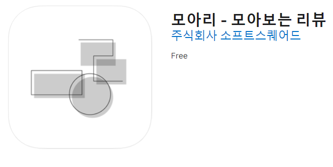
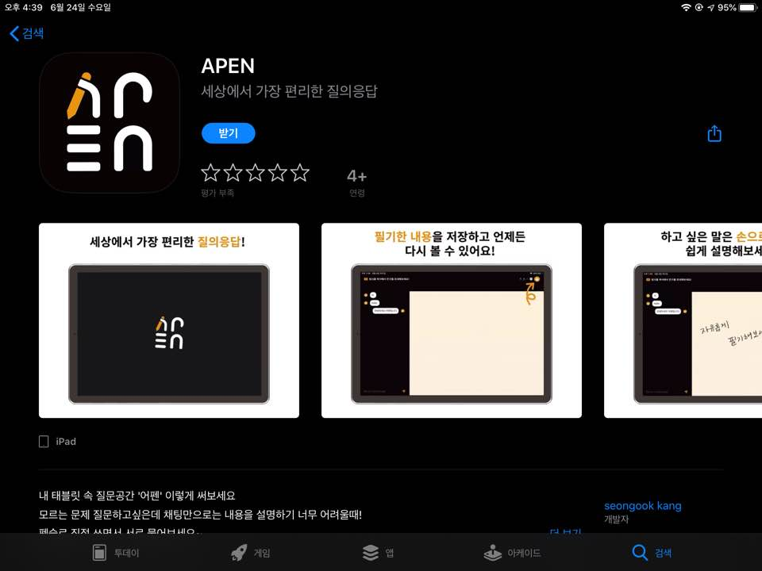

# 이력서

## 소개

 - 이름: 강보윤 
 - 취미: <b>함께코딩</b>, <b>해커톤</b>,음악,게임, <b>공모전</b> 
 - Email: boyunqueen@gmail.com 
 - GitHub: github.com/boyunjjang1 
 - Blog: https://himelog.tistory.com 
 - facebook: https://www.facebook.com/profile.php?id=100004937532760 

## 학력
 - 한국게임과학고등학교 컴퓨터게임개발과 졸업(2014~2016)
 - 인하대학교 컴퓨터공학과 재학 중 (2017 입학)

## 보유 기술
C++, C#, Unity, Python flask, Javascript, NodeJs, Github, Slack, MySql

## 수상 경력
- <b>인천광역시 공공데이터 활용 공모전 장려상(제품 및 서비스 개발 분야 3위)</b>
수상 년도 : 2019.7 
[기사 링크]: http://m.joongdo.co.kr/view.php?key=20190726010011211#_enliple

- <b>인하대학교 인하해커톤 1위</b>
- 수상년도: 2019.10

- <b>문화체육관광부 주최 문화데이터 활용 공모전 특별상</b>
수상 년도 : 2019.11 
[참조 링크]: https://www.culture.go.kr/contest/gallery.do?type=A&year=2019

- <b> 인하 스타트업 경진대회 최우수상 </b>
수상 년도 : 2020.01 
[참조링크]: https://www.inha.ac.kr/kr/1541/subview.do?enc=Zm5jdDF8QEB8JTJGYmJzJTJGa3IlMkY1OCUyRjIxODc4JTJGYXJ0Y2xWaWV3LmRvJTNGcGFnZSUzRDIlMjZzcmNoQ29sdW1uJTNEJTI2c3JjaFdyZCUzRCUyNmJic0NsU2VxJTNEJTI2YmJzT3BlbldyZFNlcSUzRCUyNnJnc0JnbmRlU3RyJTNEJTI2cmdzRW5kZGVTdHIlM0QlMjZpc1ZpZXdNaW5lJTNEZmFsc2UlMjZwYXNzd29yZCUzRCUyNg%3D%3D

- <b>6. 2020 MakeUs Challenge Spring 우수상</b>
SoftSquared X Naver Cloud Platform 후원 
수상년도 : 2020.05.23 
Node Js, Aws, Mysql 사용한 청소년 대상 원격 과외 서비스 제작 

## 활동
1. 멋쟁이 사자처럼 6기
 - 기간: 2017.3 ~ 2018.2
 - 활동:  NodeJS를 사용한 벡앤드 개발자로 참여

2. 행복한 다람쥐단 
 - 기간: 2019.7 ~ 2020.02
 - NodeJS, AWS, Mysql을 사용한 API 개발
 
3. SoftSquared 6th Server Developer, Make Us
 - 기간: 2019.09 ~
 - Node Js, Aws, Mysql 를 사용한 App 개발, ReactJs를 사용한 외주 
 
4. Moari 모아리:모아보는 리뷰 앱 출시
 - 
 - https://apps.apple.com/us/app/%EB%AA%A8%EC%95%84%EB%A6%AC-%EB%AA%A8%EC%95%84%EB%B3%B4%EB%8A%94-%EB%A6%AC%EB%B7%B0/id1503022092
 - 기간: 2020.12 ~ 02
 - IOS, ANDROID 동시 출시
 - Node Js, AWS, Mysql 사용
 
5. SoftWareMaestro 11th
 - 기간: 2020.05 ~ 2020.12
 
6. Apen I pad App 출시
 - 
 - 기간: 2020.06
 - Node Js, AWS, Mysql, nginx
 
